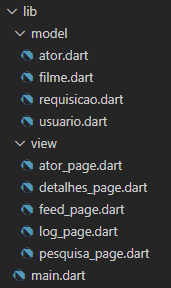

# Treinow Movies

Processo Seletivo de Estágio em Flutter na Treinow.

## Interface
### Feed de filmes
Pagina principal com uma recomendação e as listas de Filmes Populares, Filmes Bem Avaliados e Próximas Estreias. 

 
Pagina principal com 'Minha Lista' atualizada ao usuario logar. 

### Login e Cadastro
Telas de Login e Cadastro com campos de Login e Senha. 

### Pesquisa
Pagina de pesquisa em utilização após pesquisa por 'Titanic'. 

### Detalhes
Tela de detalhamento de filme com titulo, sinopse, gênero principal, 'onde assistir', elenco e opção de adicionar à 'Minha Lista'. 

### Ator
Tela com filmes listados do ator. 

## Código
Pasta 'lib'  
 
### model
  ##### <strong><em>Ator</em></strong>: Classe utilizada para listar os atores em Elenco e detalhada em AtorPage.
  ##### <strong><em>Filme</em></strong>: Classe utilizada para as listas de filmes e detalhes de filme.
  ##### <strong><em>Requisicao</em></strong>: Classe com os métodos necessários para realizar as requisições na API do TMDB.
  ##### <strong><em>Usuario</em></strong>: Classe utilizada para gerenciar usuarios do aplicativo e sua lista pessoal.
### view
  ##### <strong><em>FeedPage</em></strong>: Página principal com listas, botão de pesquisa e de log.
  ##### <strong><em>DetalhesPage</em></strong>: Página detalhadora do filme selecionada.
  ##### <strong><em>LogPage</em></strong>: Página com telas de login e de cadastro.
  ##### <strong><em>PesquisaPage</em></strong>: Página para realizar pesquisas de filme.
  ##### <strong><em>AtorPage</em></strong>: Página com filmes do ator selecionado.
